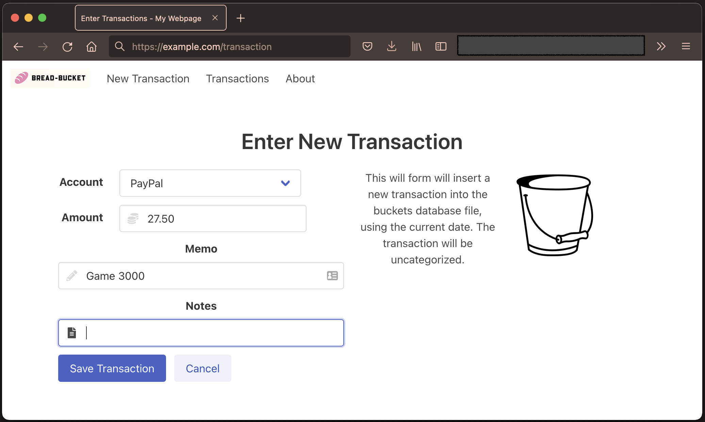
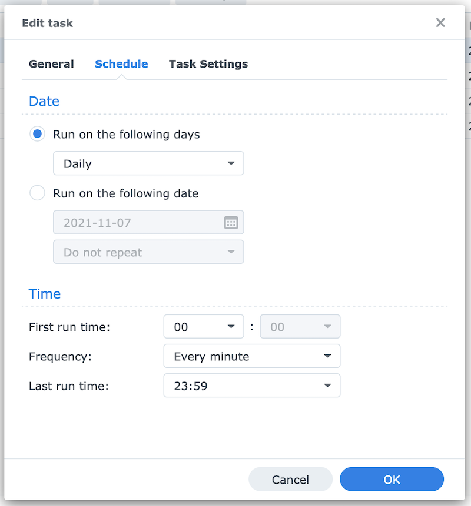
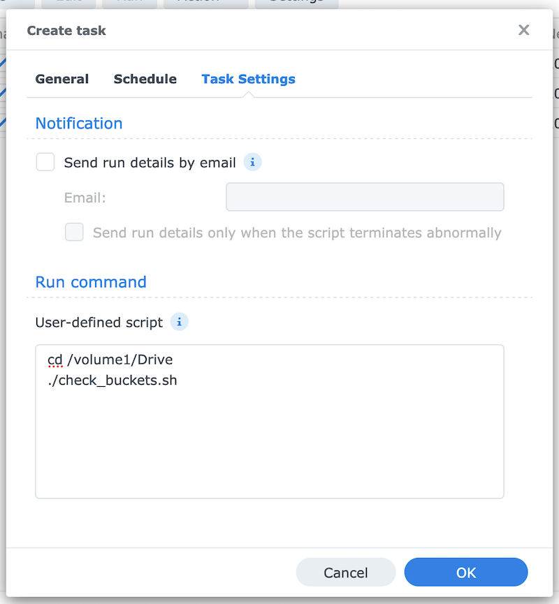

[](https://hub.docker.com/repository/docker/cmeury/bread-bucket)

# bread-bucket


Crude web app to enter transactions into 'Budget with Buckets' files. Purpose of this app is to enter transactions
on the mobile phone while on-the-go. This was hacked together to work with a buckets file synced via Synology Drive and
a container running on the same Synology device, but it should work  with other cloud storage or a different setup
altogether.

This is work in progress, needs a lot of polish.

## Screenshot



## Usage

The app is published as a container at [cmeury/bread-bucket](https://hub.docker.com/repository/docker/cmeury/bread-bucket).
Run it as follows. Ensure the `source=${HOME}/SynologyDrive/Budget.buckets` argument is customized to your setup.
Either you share the buckets file using a cloud data store such as Dropbox, Synology Drive, iCloud, etc. and then run
the app on a server that also has a local copy of the file, or you just run the application on your device where you
also run the _Budget with Buckets_ app.

    docker run -it --publish 5000:5000 \
                   --mount type=bind,source=${HOME}/SynologyDrive/Budget.buckets,target=/app/db.buckets \
                   cmeury/bread-bucket:latest

The container can be customized using the following environment variables:

* `DB_FILE`: absolute path to buckets data file (default: `/app/db.buckets`)
* `HTTP_BASIC_AUTH_USERNAME`: username for basic auth (default: `buckets`)
* `HTTP_BASIC_AUTH_PASSWORD`: password for basic auth (default: `dev`)

In any case, you need to make the web service available to the outside if you plan on using it on the go, as it is
intended. Setup for this various a lot depending on your individual configuration. In case you run a Synology server,
I have added the rough instructions to set this up below.


## Synology Setup

1. Install the Docker package, then download the  `cmeury/bread-bucket` image.
2. Setup a container with the buckets file mounted to `/app/db.buckets` and
   a port-forward from 5000 to 5000.
3. Expose the server using dynamic DNS, port-forward in your home router and a
   [reverse proxy](https://mariushosting.com/synology-how-to-use-reverse-proxy/)


### Workaround: New Docker Image

New images are not automatically used by containers on Synology. We need to manually force it:

1. Docker - Image - Add From URL: Enter `cmeury/bread-bucket`. A little blue bubble should appear next to 'Image' on the
   left.
2. Wait until image is refreshed (bubble is gone)
3. Duplicate configuration of container (Settings - Duplicate Settings)
4. Delete the old one
5. Set again the port of the new one to a static one
6. Run the new containe configuration

### Docker Mounted Folder Sync Problem Workaround

The inotify setup is not working properly in the host when a mounted file is modified inside a Docker container. So,
we need to 'touch' it after committing a new transaction to the SQLite file.

Create a file called `check_buckets.sh` in `/volume1/Drive` and make it executable: `chmod +x check_buckets.sh`.

```bash
#!/bin/bash -eu
# script that maintains a hash of a file and touches the file if it has
# changed. this is a workaround of a docker mounted volume shortcoming.

file="bun-bun-test.buckets"
md5_file="${file}.md5"

current_md5sum=$(md5sum "${file}")
stored_md5sum=$(cat "${md5_file}")

if [[ "${current_md5sum}" != "${stored_md5sum}" ]]; then
	echo "File hash changed, updating file (${md5_file}): ${stored_md5sum} -> ${current_md5sum}"
	echo "${current_md5sum}" > "${md5_file}"
	echo "Touching file to trigger Synology Drive update.."
	touch "${file}"
else
	echo "File hash unchanged: ${current_md5sum}"
fi
```

Set up a regular script (every minute or less) in [Control Panel - Task Scheduler](https://kb.synology.com/en-uk/DSM/help/DSM/AdminCenter/system_taskscheduler?version=7)
of type 'User-defined script' with the following settings:



And this script:



```bash
cd /volume1/Drive
./check_buckets.sh
```


## Development

Install node packages:

    npm install

Generate CSS file:

    npm run css-build

Watch for changes:

    npm start

Create the virtual environment and start the flask app:

    python3 -m venv venv
    pip3 install -r requirements.txt
    python3 -m flask run --host=0.0.0.0

### Build and Publish Container Image

To build the container:

    npm run docker-build

To push the container to Docker Hub:

    npm run docker-push

