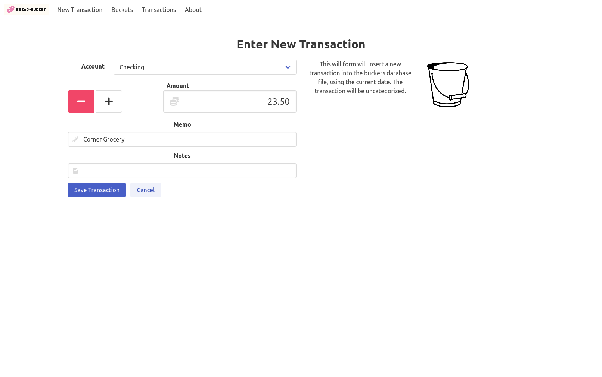

# bread-bucket

Crude web app to enter transactions into 'Budget with Buckets' files. Purpose of this app is to enter transactions
on the mobile phone while on-the-go. This was hacked together to work with a buckets file synced via Synology Drive and
a container running on the same Synology device, but it should work  with other cloud storage or a different setup
altogether.

This is work in progress, needs a lot of polish.

## Screenshot

[More available in the wiki](https://github.com/cmeury/bread-bucket/wiki/Screenshots)

## Usage

The app is published as a container at [cmeury/bread-bucket](https://hub.docker.com/repository/docker/cmeury/bread-bucket).
Run it as follows. Ensure the `source=${HOME}/SynologyDrive/Budget.buckets` argument is customized to your setup.
Either you share the buckets file using a cloud data store such as Dropbox, Synology Drive, iCloud, etc. and then run
the app on a server that also has a local copy of the file, or you just run the application on your device where you
also run the _Budget with Buckets_ app.

    docker run -it --publish 5000:5000 \
                   --mount type=bind,source=${HOME}/SynologyDrive/Budget.buckets,target=/app/db.buckets \
                   cmeury/bread-bucket:latest

The container can be customized using the following environment variables:

* `DB_FILE`: absolute path to buckets data file (default: `/app/db.buckets`)
* `HTTP_BASIC_AUTH_USERNAME`: username for basic auth (default: `buckets`)
* `HTTP_BASIC_AUTH_PASSWORD`: password for basic auth (default: `dev`)

In any case, you need to make the web service available to the outside if you plan on using it on the go, as it is
intended. Setup for this various a lot depending on your individual configuration. Example setups for both Synology and unRaid are included in the Wiki.

## Development

Install node packages:

    npm install

Generate CSS file and copy third-party Javascript to the static dir:

    npm run web-build

Watch for changes:

    npm start

Create the virtual environment and start the flask app:

    python3 -m venv venv
    pip3 install -r requirements.txt
    python3 -m flask run --host=0.0.0.0

### Build and Publish Container Image

To build the container:

    npm run docker-build

To push the container to Docker Hub:

    npm run docker-push

